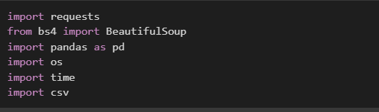

**IMDb Scraping**

# Introduction

# 1. Problem Definition:

    -   The primary challenge is to develop a robust web scraping
        algorithm capable of extracting relevant movie information from
        IMDb's website efficiently and reliably.

    -   Ensuring the accuracy and timeliness of the scraped data is
        crucial for meaningful analysis.

    -   Addressing potential issues such as data inconsistency or
        missing values during the analysis process is essential for
        producing reliable insights.

# 2. Objectives:

    -   Scrape a comprehensive dataset of movie information from IMDb,
        including attributes such as title, genre, release year, rating,
        cast, box office performance, awards won, and user reviews.

    -   Clean and preprocess the scraped data to address any
        inconsistencies or missing values.

    -   Perform exploratory data analysis (EDA) to gain insights into
        the distribution and relationships between different movie
        attributes.

    -   Utilize Power BI for visualizing and analyzing the scraped IMDb
        data to uncover trends, patterns, and correlations.

    -   Generate meaningful visualizations and reports to communicate
        insights effectively.

# 3. Planned Approach: 

    -   **Data Scraping:** Develop a web scraping algorithm using Python
        and libraries like BeautifulSoup or Scrapy to extract movie data
        from IMDb's website. Focus on collecting a comprehensive set of
        attributes for each movie.

    -   **Data Cleaning:** Implement data cleaning techniques to address
        inconsistencies, missing values, and other issues in the scraped
        dataset. Ensure data integrity and quality for analysis.

    -   **Exploratory Data Analysis (EDA):** Conduct exploratory data
        analysis to understand the distribution, trends, and
        relationships within the IMDb movie dataset. Visualize key
        insights using descriptive statistics, charts, and graphs.

    -   **Data Visualization with Power BI:** Import the cleaned and
        processed IMDb movie dataset into Power BI for further analysis
        and visualization. Utilize Power BI's features to create
        interactive dashboards, reports, and visualizations to explore
        the data.

    -   **Insights Generation:** Analyze the visualizations and reports
        generated in Power BI to derive meaningful insights into the
        movie data. Identify trends, patterns, and correlations that can
        inform decision-making or provide valuable insights.

    -   **Reporting:** Document the findings and insights obtained from
        the analysis process. Create a final report summarizing the key
        findings, along with visualizations and recommendations for
        stakeholders.

# Code

## Implementation

## URL Define

## Page Request

## Parsing HTML Content with BeautifulSoup

## Finding all Movie URLs 

## Gathering Data

## Creating a CSV File from Movie Data 

## Reading Movie Data from CSV into Pandas DataFrame

# Reports and Analysis generated by Power BI.

## Top Rated Genres

## Top Rated Genres (Tags)

# Scraped Dataset

## Table

# Conclusion

In this project, we embarked on the task of scraping IMDb data to gather
comprehensive information about movies. Through the utilization of web
scraping techniques and Python libraries like BeautifulSoup, we were
able to extract various attributes such as title, genre, release year,
rating, cast, and more from IMDb's website.

The scraped data underwent a rigorous cleaning process to address
inconsistencies and missing values, ensuring the integrity and quality
of the dataset. This cleaned dataset served as the foundation for our
exploratory data analysis (EDA), where we delved into the distribution,
trends, and relationships within the movie attributes.

Furthermore, we employed Power BI to visualize and analyze the IMDb
data, generating insightful reports and visualizations. Through these
visualizations, we were able to identify top-rated genres, analyze genre
trends over time, and gain valuable insights into the IMDb movie
landscape.

Overall, this project demonstrated the power of web scraping and data
analysis in extracting meaningful insights from online sources like
IMDb. The combination of Python for data scraping and cleaning, along
with Power BI for visualization and analysis, provided a robust
framework for uncovering trends, patterns, and correlations within the
movie data. This project lays the groundwork for future endeavors in
data-driven decision-making within the realm of movie analysis and
entertainment industry insights.
